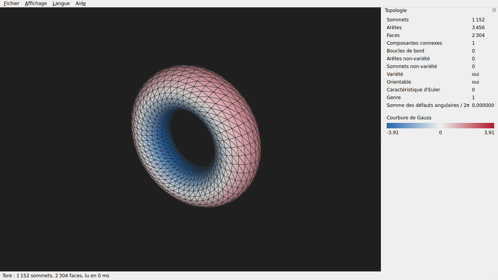

# qt : visionneuse de maillages Qt/OpenGL

[](https://github.com/Dzop86/Portfolio/actions/workflows/qt.yml)

Application de bureau Qt 6 en C++20 qui ouvre un maillage OBJ, PLY ou STL, l'affiche en OpenGL et en montre la topologie. Elle ferme la boucle du fil rouge : le fichier est lu par [lib-c](../lib-c/), la structure demi-arête, les invariants et la courbure viennent de [topologie](../topologie/).

*Qt 6 / OpenGL 3.3 desktop mesh viewer in C++20: reads OBJ, PLY and STL with the portfolio's C library, shows the topology computed by its C++ project (Euler characteristic, genus, boundaries, non-manifold elements, orientability, Gaussian curvature colours), in French and English, tested with Qt Test (including off-screen rendering read back pixel by pixel) on Linux, Windows and macOS.*



## Ce qu'elle fait (sprint 26)
- **Ouvrir** : menu Fichier, glisser-déposer, ligne de commande ; quatre exemples intégrés (tore, sphère, ruban de Möbius, selle, ceux du viewer de topologie). Une erreur de lecture garde le maillage affiché et donne la ligne fautive.
- **Regarder** : OpenGL 3.3 core, éclairage des deux faces (un ruban de Möbius n'en a qu'une), arêtes en fil de fer ; souris (gauche tourne, droit ou milieu déplace, molette zoome) et clavier (flèches, Maj+flèches, + et −, F recadre).
- **Inspecter** : panneau Topologie (sommets, arêtes, faces, composantes connexes, boucles de bord, arêtes et sommets non-variété, variété, orientabilité, caractéristique d'Euler, genre, somme des défauts angulaires sur 2π, égale à χ par Gauss-Bonnet) ; couleurs de courbure de Gauss (touche C) du bleu (selle) au rouge (dôme), avec leur légende ; arêtes de bord en pistache et non-variété en rouge (touche B).
- **Deux langues** : textes source en anglais, traduction française (`i18n/qtviewer_fr.ts`, Qt Linguist), changement à chaud par le menu Langue, nombres au format de la langue.

## Organisation
- `src/meshmodel.*` : le maillage prêt à afficher (normales, arêtes, bords, échelle de couleurs), sans OpenGL.
- `src/camera.*` : caméra orbitale (cadrage, rotation, zoom, déplacement), sans OpenGL.
- `src/renderer.*` : le dessin OpenGL (shaders GLSL 3.30), utilisé par la fenêtre, par les tests hors écran et par `--screenshot`.
- `src/viewerwidget.*`, `src/legendwidget.*`, `src/mainwindow.*`, `src/main.cpp` : l'interface.

## Compiler et lancer
Qt 6.5 ou plus (la CI utilise Qt 6.11.3), CMake 3.21, un compilateur C++20 :
```sh
cmake -S . -B build -DCMAKE_BUILD_TYPE=Release
cmake --build build --config Release
./build/qtviewer sample:torus                       # un exemple
./build/qtviewer --lang fr ../lib-c/tests/data/cube.obj
./build/qtviewer --curvature --screenshot shot.png --size 1280x720 sample:saddle   # capture, puis quitte
ctest --test-dir build -C Release --output-on-failure
cmake --build build --target update_translations   # met à jour le .ts après un changement de texte
```

## Tests
Qt Test, cinq programmes (CTest) :
- `test_meshmodel` : cube OBJ et STL, tétraèdre PLY de lib-c ; normales unitaires et sortantes ; topologie des exemples (tore de genre 1, sphère χ = 2, ruban de Möbius non orientable à un bord) ; normales sans annulation à la torsion du ruban ; arête non-variété ; échelle et couleurs de courbure ; erreur de lecture avec sa ligne.
- `test_camera` : le cadrage montre les huit coins de la boîte, l'orbite garde la distance et borne l'inclinaison, le zoom reste dans ses limites, le déplacement reste dans le plan de vue.
- `test_render` : dessin dans un framebuffer hors écran, relu pixel par pixel : vue vide, cube au centre et pas dans les coins, arêtes seulement quand elles sont demandées, sphère en rouge et selle en bleu en mode courbure, bord du ruban en pistache et aucun sur la sphère.
- `test_window` : panneau rempli, erreur qui garde le maillage et donne la ligne, changement de langue immédiat (menus, valeurs, titre, format des nombres), glisser-déposer, menu qui suit les options de la vue, clavier.
- `test_translations` : chaque texte est traduit, garde ses `%1` et son raccourci `&`, et la traduction compilée est intégrée au programme.
- Vérifié en cassant le code : sans l'alignement des normales, le test du ruban de Möbius échoue.

**CI** (`.github/workflows/qt.yml`) : Linux (GCC), Windows (MSVC) et macOS (Clang), avertissements traités en erreurs ; OpenGL logiciel sous Linux (Mesa, écran virtuel) et Windows (`opengl32sw.dll` de Qt) ; sous Linux, le `.ts` doit correspondre au code (`lupdate`), une capture est faite en ligne de commande et un fichier invalide doit faire échouer le programme. Relancée quand lib-c ou topologie changent.

## Limites
- Pas encore de sélection d'un sommet ou d'une face, ni d'exécutables prêts à installer : c'est le sprint 27.
- OpenGL 3.3 est nécessaire (une carte graphique de moins de quinze ans, ou le rendu logiciel) ; sur macOS, OpenGL est déprécié par Apple mais toujours fourni (4.1).
- Tout le maillage est envoyé à la carte en une fois : quelques millions de triangles au plus.

Relecture : [`REVIEW.md`](REVIEW.md), choix : [`DECISIONS.md`](DECISIONS.md).
