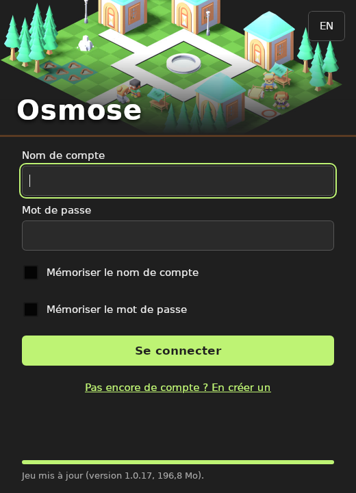
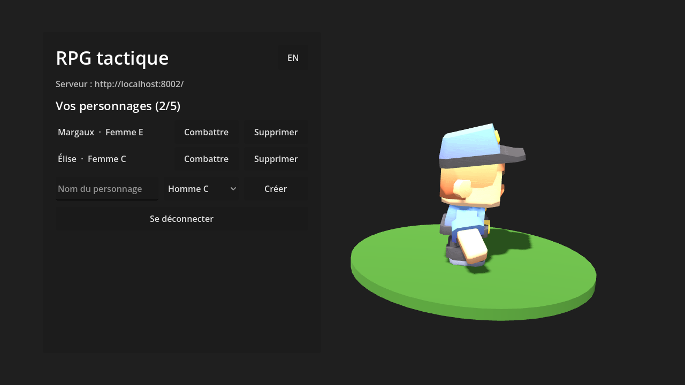
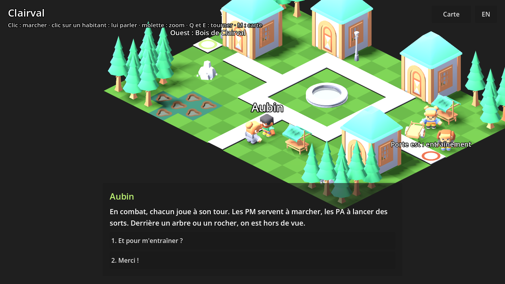
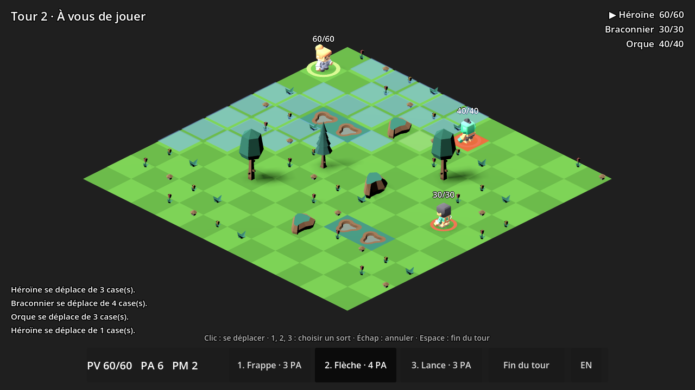

# rpg : Osmose, un RPG tactique à la manière de Dofus

[](https://github.com/Dzop86/Portfolio/actions/workflows/rpg.yml)

Un RPG tactique au tour par tour, dans l'esprit de Dofus et de Wakfu, écrit de zéro : aucun code, aucun nom, aucune image d'Ankama (D54). Six sprints : les règles du combat (sprint 45, ce dossier), le combat isométrique dans Godot 4 (46), le serveur de comptes et de personnages (47), la création de personnage (48), la ville d'accueil et ses PNJ (49), le launcher en Rust et les exécutables (50). Solo d'abord ; le multijoueur viendra plus tard, sur ces mêmes règles.

*A turn-based tactical RPG in the style of Dofus and Wakfu, written from scratch. Sprint 67: twenty-four spells per class, four per element and eight neutral ones, five at level 1 then one every five levels up to 95, each with a game-icons.net icon (CC BY 3.0) on its element's colour; the classes balanced again by simulation. Sprint 66: the characteristics named after their elements (Vitality, Earth, Water, Fire, Air) in their own colours, each giving only its element's damage, 8 AP, 4 MP and 10 initiative for every class, and points taken back and spent again at any time. Sprint 65: a spells screen (the class's twenty spells in the colour of their element, locked until their level, normal and critical damage counting the character's points and equipment, a card with everything and the next rank) and an inventory as in the games of the genre (the character in 3D surrounded by its fourteen slots, tabs, a search, a grid of icons drawn by the game). Sprint 64: characteristics that count as in the games of the genre (10 points in an element = +2 damage in that element only), critical hits with their own range, a spell about every five levels, level 1 balanced again by simulation, and a characteristics sheet showing the points put in, those of the equipment and what they give. Sprint 60: large zones described in data (a 30 × 22 wood of level 3, a 30 × 26 heath of level 10) linked to the village and to each other by ways, an explore camera that follows the player, zooms and turns a quarter at a time, a world map, and the server keeping the zone and cell one stands on. Sprint 59: fourteen equipment slots, items with a level and characteristics, sets, an inventory in pages (all, equipment, consumables, resources, quest items) and loot drawn from the server's seed, all kept and checked by the server. Sprint 58: experience and levels 1 to 100 (nothing from a monster 20 levels below, a group bonus, a first quest), 10 characteristic points and 1 spell point a level spent on a Character screen; the server draws each fight's seed, takes its record once, replays it and only then gives the experience. Sprint 57: a readable fight: hovering a fighter shows its points, resistances and statuses, aiming a spell forecasts its damage and healing on each fighter of its area, spells have full cards, the turn order is a timeline of 3D portraits, and bolts, area flashes and numbers take the colour of their element. Sprint 56: the three classes redone, twenty spells each unlocked from level 1 to 100 on two elements, shown on the creation screen; cooldowns, erosion of maximum hit points, statuses renewed rather than stacked; an AI that plans its turn; class duels in the simulator, balanced at level 1. Sprint 55: characteristics (Vitality, Strength, Intelligence, Chance, Agility) in hit points, damage and healing; spells with an unlocking level and up to five ranks; summons that join the caster's team and are played by the AI. Sprint 54: four elements and resistances, spell areas (cross, circle, line) and effects (heal, shield, push and pull with collision damage, poison and statuses over turns), described in data, replayed roll for roll, used by the AI. Sprint 53: a full-screen character creation (class, look, outfit, hair and skin colours, height and build) on Kenney's models, kept by Charles after a comparison with KayKit and Quaternius; every value checked by the server. Sprint 52: as in the games of the genre, the game opens on the server choice (Osméria, straight through while it is alone) then on the characters as cards (3D portrait, name, class, level), each character living on a server; without the launcher, the game only offers to open it or to play offline. Sprint 51: the launcher redone: it updates the game by itself, an account name, a password and "Sign in" (which starts the game), remembering the name and the password (in the system's credential store), sign-up, the server hidden, a banner of the village. Sprint 50: a Rust launcher (Tauri) that signs in, updates the game file by file from a versioned SHA-256 manifest, resumes cut downloads with HTTP ranges and starts the game with the token; unsigned packages for Windows, macOS and Linux built by the CI; a video and an architecture diagram on the project page. Sprint 49: a welcome town built from Kenney's Fantasy Town Kit, walked with a click along the shortest path, three inhabitants with bilingual dialogues and choices described in data, the character's place saved on the server, a gate to a training fight. Sprint 48: character creation with three classes described in data (characteristics and spells, balanced by simulation), twelve looks and seven outfit colours (a palette shader), checked by the server. Sprint 47: an ASP.NET Core server for accounts and characters (JWT, PBKDF2 password hashes, rate limit, EF Core and PostgreSQL, OpenAPI, Docker), and the game's login and character screen, tested end to end against it, with an offline mode. Sprint 46: a Godot 4 C# desktop client (isometric 3D board, Kenney's free animated models, mouse and keyboard play against the AI, a self-test that plays a whole fight through the controls, builds for Windows, macOS and Linux). Sprint 45: the combat rules in a deterministic C# library (isometric grid, action and movement points, A* paths, exact line of sight, spells, initiative, an AI), described by data files, recorded fights that replay roll for roll on Linux, Windows and macOS, and a terminal simulator.*

## Les règles
- **Le plateau** est une grille de cases dessinées en losanges (vue isométrique). On se déplace vers l'une des quatre cases qui partagent un côté ; toutes les distances se comptent en pas, donc une portée dessine un losange autour du lanceur. Trois terrains : le sol, les obstacles (ni passage ni vue) et les trous (pas de passage, mais les sorts passent au-dessus).
- **Un tour** : chaque combattant a des points d'action (PA) et de mouvement (PM), rendus au début de son tour. Un pas coûte 1 PM ; un sort coûte ses PA. On joue dans l'ordre d'initiative.
- **Les classes** (`data/classes.json`) : le héros du joueur prend les points de vie, PA, PM, l'initiative et les sorts de la sienne, débloqués par son niveau, et gagne à chaque niveau des PV propres à sa classe. Chacune a 20 sorts sur deux éléments, montrés à la création : Sentinelle (62 PV, 6 PA, 4 PM, Air et Eau : tir à distance, poussées, entraves), Garde (70 PV, 7 PA, Terre et Feu : corps à corps, attirance, boucliers), Mage (62 PV, 8 PA, Feu et Eau : zones, soins des alliés, invocation).
- **La progression** (`Progression`, T29) : l'XP des combats gagnés (un monstre vaut 20 + 10 × son niveau, rien s'il a 20 niveaux de moins que le héros, +10 % par allié) et des quêtes (`data/quests.json`), le niveau qu'elle donne (100 XP pour le niveau 2, 495 000 pour le 100), 10 points de caractéristique et 1 point de sort par niveau ; un rang coûte 1, 3, 6 puis 10 points en tout.
- **Le monde** (T31) : des zones décrites en données (`data/towns/`), chacune avec un niveau, une place sur la carte du monde et des chemins vers les autres (on en prend un en s'arrêtant dessus) ; le chargement refuse un chemin inaccessible ou une arrivée impossible.
- **L'équipement** (`Equipment`, T30) : quatorze emplacements, une arme à deux mains seule ; les objets (`data/items.json`) donnent caractéristiques, PA et PM à partir de leur niveau, les panoplies (`data/sets.json`) des bonus selon le nombre de pièces ; les monstres laissent un butin (`loot`) tiré d'après la graine du combat.
- **La relance, l'érosion** : après un lancer, un sort à relance attend autant de tours de son lanceur. 10 % des dégâts reçus sont aussi retirés des PV maximum, jusqu'à la fin du combat : les soins ne les rendent pas. Un même état d'un même lanceur se renouvelle au lieu de s'additionner.
- **Les éléments et les effets** : chaque sort frappe dans un élément (Terre, Feu, Eau, Air, ou neutre), que les combattants résistent en pourcentage (au plus 90 %). Un sort peut toucher une zone (croix, cercle ou ligne) : ses dégâts frappent tous les combattants de la zone, alliés compris ; ses effets suivent, chacun pour les ennemis, les alliés, tous, ou le lanceur : soin, bouclier (qui prend les dégâts d'abord, pendant quelques tours), poussée (chaque case non parcourue contre un obstacle, un combattant ou le bord coûte 4 PV) et attirance, états pour quelques tours (poison au début du tour, plus ou moins de PA, de PM, de dégâts, de résistance). Les états se décomptent à la fin de chaque tour de celui qui les porte.
- **Les coups critiques** (T32) : chaque sort a sa chance de critique (10 % pour les sorts du jeu) ; un critique ajoute un cinquième du maximum, arrondi, aux deux bornes (5 à 10 devient 7 à 12), dégâts comme soins. La prévision du combat montre les deux fourchettes.
- **Les caractéristiques** : Vitalité (1 PV par point), Force (Terre et neutre), Intelligence (Feu, et les soins), Chance (Eau), Agilité (Air) : 10 points donnent +2 dégâts dans leur élément, et dans aucun autre (+2 soins pour l'Intelligence, T32). Un sort a un niveau de déblocage et jusqu'à cinq rangs, chacun pouvant changer ses dégâts, son coût, sa portée maximale ou ses lancers par tour ; un héros reçoit les sorts de sa classe débloqués à son niveau (100 au plus). Un sort peut invoquer une créature de `data/summons.json` sur une case libre : elle rejoint l'équipe du lanceur, joue juste après lui, est jouée par l'IA et meurt avec lui.
- **Les sorts** ont une portée minimale et maximale, demandent ou non la ligne de vue, peuvent n'être lancés qu'en ligne droite et un nombre de fois limité par tour. Les dégâts sont tirés entre deux bornes.
- **La ligne de vue** suit exactement le segment entre les centres des deux cases, en nombres entiers : si A voit B, B voit A. Les obstacles et les combattants la coupent, les trous non. Un segment qui passe pile par un coin n'est coupé que si les deux cases de part et d'autre bloquent.
- **La fin** : une équipe qui n'a plus personne a perdu ; au-delà de 50 tours, match nul.

```
...........      a Héros 20/60
.....a.....      B Sanglier 0/30
....#......      C Crapaud 0/22
..~~...#...
...........      # obstacle   ~ trou
```

## Jouer
Avec le SDK .NET 10 et Godot 4.7 (version .NET) :
```sh
dotnet build godot/Rpg.Godot.csproj
docker compose up --build rpg-api          # depuis la racine du dépôt : le serveur, sur le port 8002
godot --path godot -- --lang fr            # options : --server URL, --offline, --scenario duel, --seed 7
```
Le jeu s'ouvre sur l'écran de connexion : créer un compte ou se connecter, puis créer un personnage (un nom, l'une des 12 apparences, une classe et l'une des 7 couleurs de tenue ; le modèle, repeint, tourne à côté du formulaire) et le choisir. On arrive au village de Clairval : un clic fait marcher par le plus court chemin (montré en jaune), un clic sur un habitant y mène et ouvre la conversation (réponses au clic ou aux touches 1 à 4), la porte est et Garance mènent au combat d'entraînement ; à la fin du combat, « Retour en ville », et « Personnages » ramène à la liste. Sans serveur, « Jouer hors ligne » mène au village avec l'héroïne du scénario. Ou sans rien installer : les exécutables Windows, macOS et Linux produits par la CI (artefacts du workflow `rpg`, non signés : Windows et macOS avertissent au premier lancement).

**Le launcher** (`launcher/`, Rust et Tauri) : paquets `rpg-launcher-*` des artefacts de la CI (`.deb` et AppImage, installeur Windows, `.dmg`), éditeur « Osmose Team », non signés eux aussi. À l'ouverture, il met le jeu à jour tout seul : il compare le jeu installé au manifeste publié (taille et SHA-256 de chaque fichier), ne télécharge que les fichiers modifiés, reprend un téléchargement coupé et vérifie chaque fichier. La fenêtre ne demande que le nom de compte et le mot de passe : « Se connecter » attend la fin de la mise à jour puis lance le jeu avec le jeton (variables `RPG_SERVER` et `RPG_TOKEN` : le jeu s'ouvre directement sur les personnages). Deux cases mémorisent le nom (fichier `launcher.json` du dossier de configuration) et le mot de passe (gestionnaire d'identifiants de Windows, trousseau de macOS, Secret Service sous Linux ; jamais dans un fichier). Un lien permet de créer un compte. L'adresse du serveur n'est plus affichée : `RPG_SERVER`, ou `"server"` dans `launcher.json`, la change. Pour publier une version en local :
```sh
godot --headless --path godot --export-release Linux               # dans godot/build/linux
cargo run --manifest-path launcher/Cargo.toml -p rpg-launcher-core --bin rpg-manifest -- godot/build/linux 1.0.0
docker compose up --build rpg-api                                  # sert godot/build sous /updates
# godot/build doit exister avant : sinon Docker le crée au nom de root, et l'export ne peut plus y écrire.
cargo run --manifest-path launcher/Cargo.toml -p rpg-launcher-core --bin rpg-update -- http://localhost:8002 ./jeu linux
cd launcher/app && npx @tauri-apps/cli@2.5.0 dev                   # la fenêtre du launcher
```



- **Souris** : survoler une case montre le chemin (jaune) parmi les cases atteignables (bleu clair) ; cliquer s'y rend. Avec un sort choisi, sa portée est marquée, les cases qu'il peut toucher en bleu, la cible en rouge ; clic droit pour annuler.
- **Clavier** : 1, 2, 3 choisissent un sort, Échap annule, Espace finit le tour. Le bouton FR/EN change de langue.





## Organisation
- **`src/Rpg.Core`** (net10.0, sans dépendance) :
  - `Cell.cs` : cases, voisins, distances.
  - `Board.cs` : le plateau, lu depuis des lignes de caractères.
  - `Pathfinding.cs` : plus court chemin par A* (égalités départagées dans un ordre fixe), cases atteignables par parcours en largeur.
  - `LineOfSight.cs` : les cases traversées par le segment, coins compris, sans arrondi.
  - `Fight.cs`, `Actions.cs` : le combat ; chaque action est vérifiée, une action refusée ne change rien et dit pourquoi ; les événements (déplacement, sort, dégâts, mort, fin) servent à l'affichage.
  - `Ai.cs` : un adversaire déterministe (frapper le plus fort, sinon se placer, sinon s'approcher en contournant les obstacles).
  - `FightRecord.cs` : un combat enregistré (scénario, graine, actions) et son rejeu.
  - `Data.cs` : sorts, cartes et scénarios lus depuis `data/`, refusés s'ils sont incohérents.
- **`src/Rpg.Sim`** : le simulateur en ligne de commande.
- **`src/Rpg.Api`** (ASP.NET Core, API minimale) : le serveur des comptes et des personnages.
  - `GET /api/servers` (les serveurs de jeu, tirés de la configuration `Servers:N:Id` / `Servers:N:Name` ; Osméria par défaut), `POST /api/accounts` (créer un compte), `POST /api/tokens` (se connecter : un jeton JWT valable 12 heures), `GET`, `POST /api/characters`, `DELETE /api/characters/{id}`, `PUT /api/characters/{id}/place` ; progression (T29) : `POST /api/characters/{id}/fights` (le serveur tire la graine d'un combat), `POST /api/characters/{id}/fights/{fight}` (l'enregistrement, une seule fois : rejoué, puis l'XP), `PUT /api/characters/{id}/points` (caractéristiques et rangs, dans les limites du niveau), `PUT /api/characters/{id}/equipment` (ce qui est porté, parmi ce qui est possédé) ; le rejeu d'un combat ajoute aussi son butin à l'inventaire et `PUT /api/characters/{id}/place` (où il se tient en ville : refusé si l'on ne peut pas y marcher depuis l'arrivée) (avec le jeton) ; description OpenAPI sur `/openapi/v1.json`, Swagger UI sur `/swagger`.
  - Mots de passe hachés par PBKDF2 (le `PasswordHasher` d'ASP.NET Core Identity) ; un nom inconnu coûte autant qu'un mauvais mot de passe, et la réponse est la même. Inscription et connexion limitées à 10 essais par minute et par adresse.
  - Noms de compte uniques, noms de personnage uniques sur tout le serveur, sans tenir compte de la casse (index unique sur le nom en majuscules : deux créations simultanées ne passent pas toutes les deux) ; cinq personnages au plus par compte ; le personnage d'un autre se comporte comme un personnage absent (404).
  - EF Core 10 et PostgreSQL (Npgsql), migrations par `dotnet ef` (outil épinglé dans `.config/dotnet-tools.json`), appliquées au démarrage. Image Docker « chiseled » (sans shell, utilisateur non root), service `rpg-api` de `compose.yaml` avec sa base `rpg-db`, qui n'est pas exposée.
- **`src/Rpg.Client`** : en plus du combat, `GameServer` (les appels HTTP du jeu, partagés avec les tests) et `Lobby` (ce que l'écran de connexion peut faire : chaque refus devient un message des deux langues, les vérifications du serveur sont faites d'abord sur place, un serveur injoignable propose le jeu hors ligne).
- **`src/Rpg.Client`** (sans Godot) : le côté joueur d'un combat, testé sans moteur : sort choisi, aperçu au survol (`Hover`), clic (`Click`), fin de tour, tours de l'IA, textes français et anglais, et `SelfPlay`, qui joue un combat entier en passant par ces commandes.
- **`godot/`** : le client Godot 4.7 en C#. Il ne fait que dessiner : `BoardView` (plateau 3D, surbrillances, case sous la souris par un rayon de la caméra), `FighterView` (modèle animé, anneau d'équipe, PV, dégâts), `Hud` (tour, ordre de jeu, sorts, journal, fin), `LobbyView` (l'écran de connexion et des personnages), `Main` (l'écran de connexion puis le combat, enchaîne les animations, fait jouer l'IA, options `--selftest`, `--lobby-selftest` et `--screenshot`). Modèles 3D de Kenney (CC0, licences dans `godot/assets/kenney/`). Icônes des sorts de game-icons.net (CC BY 3.0) : Lorc, Delapouite et Sbed ; l'auteur de chaque icône dans `godot/assets/icons/spells/credits.json`, le fond noir retiré, posées sur la couleur de l'élément (`SpellIcon`).
- **`godot/shaders/outfit.gdshader`** : la couleur de tenue. La texture des personnages de Kenney est une palette de cases ; le shader décale les sept colonnes colorées (vert à violet) de 0 à 6 crans, si bien que vêtements et accessoires changent ensemble sans toucher à la peau, aux cheveux ni aux gris. `Looks.MainColumn` lit dans le maillage la couleur dominante de chaque apparence, pour que chaque pastille montre la teinte réellement obtenue.
- **La ville** : `data/towns/*.json` décrit la carte en lignes de caractères (`.` herbe, `=` route, `H` maison de 2 × 2 cases, `F` fontaine, `T` arbre, `R` rocher, `S` étal, `L` lanterne, `C` charrette, `~` eau), l'arrivée, les habitants (apparence, couleur, case, dialogue) et les portes (vers quel combat) ; `data/dialogues/*.json`, les répliques et les réponses (vers une autre réplique, la fin, ou un combat). Au chargement, chaque habitant et chaque porte doivent être accessibles à pied depuis l'arrivée, chaque réplique atteignable, et chaque conversation doit pouvoir finir. `Rpg.Client` : `TownController` (ce qu'un clic fait en ville) et `TownTour` (tout le village par ces clics, pour l'auto-test) ; `godot/` : `TownView` (le village 3D, maisons montées à partir des murs et des toits du Fantasy Town Kit de Kenney, CC0), `TalkPanel` (la conversation), `Main.Town.cs`.
- **`launcher/`** (Rust) : `core`, une bibliothèque testée sans fenêtre (`manifest` : manifeste, empreintes, plan de mise à jour, refus d'un chemin qui sortirait du dossier du jeu ; `update` : téléchargement avec reprise par en-tête `Range`, vérification, mise à jour complète, manifeste local écrit en dernier ; `server` : connexion ; `launch` : commande du jeu) et ses deux outils, `rpg-manifest` et `rpg-update` ; `app`, la fenêtre Tauri (le jeton reste du côté Rust, la page ne le voit jamais) ; `ui`, la page (HTML, CSS, JavaScript, français et anglais).
- **`data/`** : `spells.json`, `classes.json`, `towns/*.json`, `dialogues/*.json`, `maps/*.json`, `scenarios/*.json` (chaque combattant y a un `look`, le modèle 3D qui le montre). Ajouter un sort, une carte ou un monstre se fait ici, sans toucher au code ; les fichiers sont intégrés à `Rpg.Core`, donc le jeu exporté, le serveur et les tests lisent les mêmes.
- **`samples/`** : deux combats de l'IA, rejoués par la CI sur les trois systèmes.
- **`tools/spells_gen.py`** : écrit les 62 sorts et les listes des classes ; il porte la règle de dégâts par PA de T27 (`python3 tools/spells_gen.py data`).

## Lancer
SDK .NET 10 :
```sh
dotnet test --project tests/Rpg.Core.Tests
dotnet run --project src/Rpg.Sim -- --simulate 1000 --scenario duel
dotnet run --project src/Rpg.Sim -- --record combat.json --scenario training --seed 7 --lang fr
dotnet run --project src/Rpg.Sim -- --replay combat.json --show --lang fr
```
Le serveur et ses tests demandent PostgreSQL :
```sh
docker run -d --name rpg-pg -p 5432:5432 -e POSTGRES_HOST_AUTH_METHOD=trust postgres:18-alpine
RPG_TEST_DB="Host=localhost;Username=postgres" dotnet test --project tests/Rpg.Api.Tests
ConnectionStrings__Game="Host=localhost;Username=postgres;Database=rpg" dotnet run --project src/Rpg.Api
scripts/smoke.sh http://localhost:8002     # contre docker compose : de l'inscription au refus d'une requête trop grosse
```
La clé qui signe les jetons vient de `Jwt__Key` (base64, 32 octets, variable d'environnement ; `RPG_JWT_KEY` pour docker compose). Sans clé, le serveur en tire une au démarrage, et les jetons ne survivent pas à un redémarrage.

## Tests
Sprints 66 et 67 : les tests repris pour les éléments renommés, la règle sans soins ni neutre, les bases communes et les 24 sorts (structure : quatre par élément, huit neutres, cinq au niveau 1 puis un tous les cinq niveaux, une icône chacun) ; 2 tests de plus (`Rpg.Core` : dégâts neutres et soins sans caractéristique ; `Rpg.Client` : reprendre ses points et les dépenser ailleurs, par valeur, MIN ou MAX) ; combats enregistrés et auto-test de combat refaits.

Sprint 65 : 6 tests de plus dans `Rpg.Client` (livre de sorts : tous les sorts de la classe, verrouillés compris ; dégâts au rang avec les points de leur seul élément, normaux, critiques et au rang suivant ; filtre par élément ; fiche détaillée de chaque sort dans les deux langues ; forme et couleur des icônes, égalités comprises ; recherche sur tous les mots, sans casse ni accents) ; `--town-selftest` vérifie que l'onglet des sorts montre tous ceux de la classe. 5 mutations, 5 attrapées (une d'abord manquée, l'égalité des caractéristiques d'un objet, a demandé un test).

Sprint 64 : 7 tests de plus dans `Rpg.Core` (tranches de 10 points, bonus du critique arrondi, critique sur les dégâts et les soins et annoncé, fréquence du critique, un sort sûr de son critique le réussit toujours, fourchette critique de la prévision, un sort tous les cinq niveaux) et des tests repris pour la nouvelle règle, 4 dans `Rpg.Client` (fiche : points investis et portés, ce que le total donne, la fiche dit ce que le combat compte, carte de sort avec les points du lanceur) ; combats enregistrés réenregistrés. 5 mutations : 4 attrapées (une d'abord manquée, `<` au lieu de `<=` pour le critique, a demandé un test de plus), 1 équivalente (l'arrondi au plus proche ou au pair : un cinquième d'un entier ne tombe jamais sur une demie).

Sprint 60 : 3 tests de plus dans `Rpg.Core` (chaque zone atteinte depuis Clairval et chaque chemin avec son retour, grandes zones de niveaux croissants à des places distinctes de la carte, chemin vers nulle part ou sur un arbre refusé), 3 du client (prendre un chemin en s'arrêtant dessus et pas en passant, tour du monde, caméra qui suit, zoome dans ses bornes et tourne d'un quart), 1 du serveur étendu (la position gardée dans une autre zone, une case impossible refusée) ; `--town-selftest` dessine chaque zone, vérifie que la caméra garde le joueur au milieu de l'écran à chaque quart et chaque zoom, et que la carte montre toutes les zones. 4 mutations : 3 attrapées, 1 équivalente (la condition « arrivé sur la case cliquée » d'un chemin est toujours vraie hors habitant).

Sprint 59 : 7 tests de plus dans `Rpg.Core` (les quatorze emplacements pourvus, emplacement, niveau et arme à deux mains, bonus de panoplie, équipement compté en combat, butin fidèle à la graine et à ses chances, seulement après une victoire, équipement gardé par l'enregistrement, objets incohérents refusés), 2 du serveur (butin et objets de quête dans l'inventaire ; seulement ce qu'on possède, là où ça va, et le combat suivant joué avec), 4 du client (pages, mettre et enlever avec les règles, fiche de chaque objet, butin sur l'écran de fin) ; `--town-selftest` vérifie l'écran d'inventaire, `--lobby-selftest` que le serveur garde le butin du combat. 3 mutations, 3 attrapées.

Sprint 58 : 11 tests de plus dans `Rpg.Core` (courbe d'XP, XP d'un combat gagné, écart de 20 niveaux, combat perdu, rival et invocations, bonus de groupe, points de caractéristique et de sort, coût des rangs, sorts d'une autre classe ou pas encore débloqués, points comptés en combat, construction du simulateur à tous les niveaux, points gardés par l'enregistrement), 4 du serveur (XP d'un combat que le serveur a lancé, une seule fois, quête au premier combat gagné ; graine, héros, scénario, combat inachevé ou action forgée refusés ; personnage d'un autre ; points dans les limites, et le combat suivant joué avec eux), 4 du client (boutons des points, rangs, brouillon envoyé au serveur, écran de fin) ; `--lobby-selftest` rend le combat au serveur et vérifie qu'il garde exactement l'XP des règles, `--town-selftest` ouvre l'écran « Personnage ». 5 mutations (2 des règles, 3 du serveur), 5 attrapées.

Sprint 57 : 5 tests de plus dans `Rpg.Core` (la prévision encadre chaque jet et atteint ses deux bornes, toute la zone alliés compris, soins plafonnés, coup mortel, frise des prochains tours sans les morts, élément de chaque coup), 4 dans `Rpg.Client` (fiche d'un combattant et ses états dans les deux langues, prévision au-dessus de la fiche, fiche de chacun des 62 sorts, couleurs distinctes). `--selftest` vérifie après chaque action la frise (noms et portraits), le panneau de survol de chaque combattant, la prévision d'un sort visé et la couleur du dernier chiffre au-dessus de chacun. 6 mutations (3 des règles, 3 des vues), 6 attrapées.

Sprint 56 : 13 tests de plus dans `Rpg.Core` (relance, érosion et soins plafonnés, état renouvelé ou additionné selon le lanceur, PV par niveau de chaque classe, duel de classes enregistré et rejoué, IA : plan de tour, recul du contact, coup mortel, achèvement, PA dépensés, poison encore actif ; 20 sorts par classe sur deux éléments ; duels de niveau 1 gagnés des deux côtés ; aux niveaux 50 et 100, aucun duel nul), 1 du simulateur (`--rival`, `--level`), 1 du client (classe et sorts par niveau dans les deux langues) ; `--lobby-selftest` vérifie que l'écran de création liste les 20 sorts. 8 mutations : 7 attrapées (la prime d'achèvement après un test ajouté), la dernière presque équivalente (le coup mortel joué d'abord, que la prime d'achèvement donne déjà).

Sprint 55 : 13 tests de plus dans `Rpg.Core` (Vitalité, chaque caractéristique dans son élément et pas ailleurs, soins et Intelligence, rangs, sorts débloqués par le niveau, invocation : équipe, ordre de jeu, limite, case occupée, mort avec l'invocateur, combat avec invocations rejoué, données incohérentes refusées), 1 dans `Rpg.Client` (une invocation de l'équipe du joueur est jouée par l'IA). 4 mutations : 3 attrapées, la dernière équivalente (une condition inutile, retirée).

Sprint 54 : 17 tests de plus dans `Rpg.Core` (élément et résistance, plafond de 90 %, croix, cercle et ligne avec les alliés touchés, soin des alliés seuls, bouclier qui absorbe puis s'use, poussée libre, contre un arbre, le bord et un autre combattant, attirance, poison et fin de combat par poison, bonus et malus de PA, PM, dégâts et résistance, combat à effets rejoué à l'identique, l'IA qui soigne et épargne ses alliés, effets incohérents refusés, lecture du JSON), 1 dans `Rpg.Client` (le journal des effets dans les deux langues). Les combats enregistrés et les auto-tests donnent exactement les mêmes résultats qu'avant. 6 mutations, 6 attrapées (deux après deux tests ajoutés).

Sprint 53 : 1 test des règles (l'apparence vérifiée, sans effet sur le combat, gardée par un combat enregistré), 1 du serveur (apparence gardée, chaque champ refusé avec son nom) ; `--lobby-selftest` crée un personnage avec couleur de tenue, de cheveux, teint, taille et carrure par l'écran de création, et vérifie que le serveur garde exactement cette apparence.

Sprint 52 : 2 tests du serveur (un seul serveur sans configuration et les personnages y vivent ; serveurs configurés, personnage créé sur celui choisi, serveur inconnu refusé, liste accessible sans compte), 1 du client (un serveur choisi d'office, plusieurs attendent le choix, personnages filtrés par serveur, création refusée sans serveur), mises à jour de ceux qui comptaient les requêtes et les champs ; `--lobby-selftest` passe maintenant par les cartes : le héros créé doit apparaître sur sa carte (nom, classe, niveau), être choisi, puis « Jouer ».

Sprint 51 : 7 tests Rust de plus (rien n'est mémorisé sans le demander, le nom et le mot de passe reviennent et le mot de passe mémorisé suffit, décocher oublie, un autre compte fait oublier le premier, un mauvais mot de passe ne mémorise rien, un gestionnaire d'identifiants verrouillé n'empêche pas de jouer, l'inscription et ses refus, l'ordre de choix du serveur) ; 2 tests Playwright de la page du launcher, sur les cinq navigateurs, avec un faux Tauri (mise à jour dès l'ouverture, cases pré-cochées, refus traduits, mot de passe vérifié sur la page avant l'inscription, « Se connecter » qui attend la mise à jour puis lance, les deux langues, tout tient dans la fenêtre).

Sprint 50 : 13 tests Rust (`cargo test`) : premier téléchargement complet puis plus rien, seuls les fichiers modifiés ensuite et les anciens retirés, fichier abîmé sur le disque retéléchargé, téléchargement coupé repris là où il s'était arrêté (avec un serveur qui ignore la reprise aussi), fichier qui ne correspond pas à son empreinte jamais installé, manifeste qui tenterait d'écrire hors du dossier refusé, exécutable rendu exécutable, progression, et contre un vrai serveur HTTP : reprise par `Range` (206), connexion et ses refus, jeton passé par l'environnement ; clippy au niveau `all`, avertissements bloquants. 3 tests du serveur (fichiers servis avec reprise, rien hors du dossier, jeton du launcher). Dans la CI : le launcher compilé, testé et empaqueté sur les trois systèmes ; puis, de bout en bout, l'export Linux du jeu publié par docker compose, installé par `rpg-update`, mis à jour sans rien télécharger, réparé après un fichier abîmé, et qui joue un combat entier depuis le dossier installé. Playwright : la fiche (vidéo, schéma, capture du launcher) sur les cinq navigateurs, avec axe.

Sprint 49 : 4 tests de plus dans `Rpg.Core` (le village cohérent, la carte lue depuis ses lignes, villes et dialogues incohérents refusés : maison incomplète, habitant emmuré, porte vers un combat inconnu, réplique inatteignable, boucle sans fin), 7 dans `Rpg.Client` (chemin le plus court autour des maisons et de l'eau, clic sur un habitant jusqu'à son côté le plus proche, conversation, porte et Garance vers le combat, retour à la position gardée, tour complet du village), 2 du serveur (position gardée si l'on peut y marcher, réponse sans champ calculé). Dans la CI, sur les trois systèmes, `--town-selftest` parle à chaque habitant, vérifie que chaque réplique et ses réponses sont celles à l'écran, passe la porte et joue le combat ; contre le serveur, `--lobby-selftest` fait tout le chemin (inscription, personnage, village, position enregistrée et relue sur le serveur, combat). 3 mutations, 3 attrapées (la troisième après un test ajouté).

Sprint 48 : 7 tests de plus dans `Rpg.Core` (une classe donne ses caractéristiques et ses sorts, classes incohérentes refusées, classe ou couleur inconnue refusée en combat et au rejeu, un combat enregistré garde classe et couleur, l'équilibre de chaque classe sur 1 000 combats), 1 du simulateur (`--class`), 6 du serveur (classe et couleur refusées avec le champ fautif, gardées, un personnage du sprint 47 devenu Sentinelle par la migration), 4 du client. L'auto-test de l'écran crée une Mage de couleur 3 et vérifie en combat sa barre de sorts et la couleur de son modèle. 3 mutations, 3 attrapées.

Sprint 47 : 22 tests d'intégration (`tests/Rpg.Api.Tests`, `WebApplicationFactory` sur une vraie base PostgreSQL créée pour chaque test puis supprimée), écrits avec le client du jeu (`GameServer`, `Lobby`) : inscription, connexion, jeton expiré (horloge avancée de 13 heures), limite d'essais, noms pris quelle que soit la casse, cinq personnages au plus, personnages d'un autre joueur invisibles et intouchables, personnage du serveur qui combat et dont le combat se rejoue. 11 tests de plus dans `Rpg.Client` (l'écran sans serveur, serveur injoignable, session expirée, textes des deux langues pour chaque refus). Dans la CI : migrations à jour du modèle, image Docker construite et servie par `compose.yaml`, `scripts/smoke.sh` contre elle, puis le client Godot contre ce même serveur (`--lobby-selftest`) : inscription, création et choix d'un personnage par les champs et les boutons de l'écran, puis un combat entier avec ce héros. Vérifiés en cassant le code : 4 mutations du serveur, 4 attrapées.

Sprint 46 : 10 tests de `Rpg.Client` (aperçu, clics, choix de sort, tour de l'IA, 200 combats joués par les commandes identiques à ceux de l'IA seule, textes des deux langues) ; dans la CI, sur les trois systèmes, le client Godot joue un combat entier par ses commandes (`--selftest`) en vérifiant après chaque action que les personnages, leurs PV, les cases montrées et les points affichés suivent le combat ; l'exécutable Linux exporté rejoue ce test.

Sprint 45 : 57 tests xUnit des règles (`tests/Rpg.Core.Tests`) et 10 du simulateur. Parmi eux : les chemins d'A* comparés à un parcours en largeur sur 200 plateaux tirés au hasard ; la ligne de vue identique dans les deux sens sur 3 000 paires et comparée au segment échantillonné ; 600 combats de l'IA qui se terminent sans une action refusée ; 400 combats enregistrés, passés en JSON et rejoués à l'identique ; l'équilibre mesuré sur 2 000 combats, dans une fourchette (leçon du sprint 23 du roguelike). Vérifiés en cassant le code : 13 mutations, 12 attrapées, la dernière équivalente (voir `REVIEW.md`).

## Limites
- Launcher et jeu non signés : Windows (SmartScreen) et macOS (Gatekeeper) avertissent au premier lancement ; le launcher ne se met pas à jour lui-même. Les mises à jour sont publiées sans signature : le SHA-256 protège d'un fichier abîmé, pas d'un serveur compromis (il faudrait signer le manifeste). La fenêtre Tauri n'est essayée que sous Linux en local ; sous Windows et macOS, la CI la compile et l'empaquette sans l'ouvrir.
- Un seul village, sans quêtes ni objets : les réponses ne changent rien d'autre que la suite de la conversation ou le combat. La position n'est enregistrée qu'à la fin d'une marche ; hors ligne, elle ne dure que le temps de la partie.
- Le serveur se teste sous Linux seulement : les machines Windows et macOS de GitHub ne lancent pas de conteneurs Linux (il y est compilé). Il parle HTTP : en ligne, il faudra un proxy HTTPS devant. Pas encore de suppression de compte, de changement de mot de passe ni de jeton de rafraîchissement : après 12 heures, on se reconnecte. La limite de cinq personnages se vérifie avant l'insertion : deux créations simultanées sur un même compte pourraient en donner six (l'unicité des noms, elle, est garantie par la base).
- Le client se joue à la souris et au clavier, pas encore à la manette ni au toucher. Les captures se font avec le rendu logiciel de Mesa ; sur une vraie carte graphique, ombres et anticrénelage sont plus nets.
- Après T34 (niveau 1) : entraînement Sentinelle 83 %, Garde 91 %, Mage 65 %, héroïne sans classe 66 % ; duels de classes 42 à 48 % ; duel symétrique 45 %. Les PV des classes et des adversaires de l'entraînement ont été cherchés par balayage : l'équilibre bascule d'un coup à quelques PV près.
- Avant T34 : au niveau 1, entraînement Sentinelle 78 %, Garde 65 %, Mage 83 %, héroïne sans classe 68 %, duel symétrique 45 %, duels de classes de 38 à 61 %. Aux niveaux 50 et 100, les duels restent tranchés : la Garde gagne 96 à 100 % de ses duels ; à régler classe par classe (à trancher avec Charles).
- Classes équilibrées au niveau 1 seulement (T27) : duels de classes de 38 à 54 % en moyennant les deux ordres de jeu, entraînement Sentinelle 83 %, Garde 70 %, Mage 84 %. Aux niveaux 25 à 100, chaque duel est tranché (0 ou 100 %) : ce sont des courses aux dégâts presque déterministes, et les héros y combattent avec des sorts au rang 1 et sans caractéristiques, qui viendront au sprint 58. Le niveau 1 lui-même est sur le fil : 4 PV de moins à la Sentinelle et à la Mage font passer Garde contre Mage de 52 à 85 %.
- La couleur de tenue tourne la palette : sur un modèle à plusieurs couleurs, chacune change, et deux modèles ne prennent pas la même teinte au même cran (les pastilles montrent celle du modèle choisi).
- Équilibre mesuré par simulation : à l'entraînement, l'héroïne sans classe jouée par l'IA gagne 71 % des combats (35 PV depuis que l'IA planifie son tour, 60 avant) ; un joueur fera mieux. Le duel symétrique se gagne à peu près une fois sur deux.
- Hors ligne, ni XP, ni points, ni objets gardés. Les consommables ne s'utilisent pas encore ; on ne vend ni ne jette rien (T30). Les zones n'ont pas encore leurs monstres, le serveur ne vérifie pas qu'on est arrivé dans une zone par un chemin, la caméra ne s'arrête pas au bord d'une zone et la carte ne sert pas à voyager (T31). L'équilibre de haut niveau reste à régler (T29, mesures) : il dépend fortement de la valeur d'un point de caractéristique et de la façon de les dépenser.
- La prévision des dégâts ne retire pas les boucliers de ses chiffres et ignore collisions et poisons à venir (T28) ; les effets visuels sont simples et la vidéo de la fiche montre encore le combat du sprint 50.
- L'IA planifie un tour, pas davantage : elle recule du contact mais ne fuit pas un combat perdu, ne protège pas ses alliés, et compte deux fois les dégâts d'un sort lancé deux fois sur une cible qui mourrait au premier.
